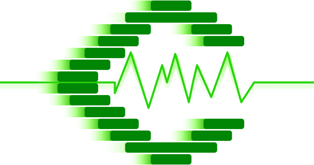

# Crypto Static Rate

<div style="text-align: center; padding: 6px; margin: 6px;">
    <a href="https://github.com/Crypto-Static/Rate" title="Crypto Static Rate">
        
    </a>
</div>

---

:bar_chart: JSON Format : [Latest Update](https://github.com/Crypto-Static/Rate/raw/main/rateStatic.json 'rate static free api crypto')

:white_check_mark: Direct : `https://github.com/Crypto-Static/Rate/raw/main/rateStatic.json`

---

|                    | :abacus: | :label: ADA-USDT    |
|:------------------:|:------------------------|:-----------|
| :white_check_mark: | _Last Price_ | `0.1502` |
| :white_check_mark: | _High Price 24h_ | `0.1504` |
| :white_check_mark: | _Low Price 24h_ | `0.1443` |
| :white_check_mark: | _Change Rate_ | `0.0394` |
| :white_check_mark: | _Last Updated_ | `2026-11-26 18:56:17` |


|                    | :abacus: | :label: ALGO-USDT    |
|:------------------:|:------------------------|:-----------|
| :white_check_mark: | _Last Price_ | `0.00004712` |
| :white_check_mark: | _High Price 24h_ | `0.00004757` |
| :white_check_mark: | _Low Price 24h_ | `0.00004606` |
| :white_check_mark: | _Change Rate_ | `0.023` |
| :white_check_mark: | _Last Updated_ | `2026-11-26 18:56:17` |


|                    | :abacus: | :label: ATOM-USDT    |
|:------------------:|:------------------------|:-----------|
| :white_check_mark: | _Last Price_ | `0.00001994` |
| :white_check_mark: | _High Price 24h_ | `0.00002117` |
| :white_check_mark: | _Low Price 24h_ | `0.00001953` |
| :white_check_mark: | _Change Rate_ | `-0.0531` |
| :white_check_mark: | _Last Updated_ | `2026-11-26 18:56:17` |


|                    | :abacus: | :label: AVAX-USDT    |
|:------------------:|:------------------------|:-----------|
| :white_check_mark: | _Last Price_ | `0.00010988` |
| :white_check_mark: | _High Price 24h_ | `0.0001101` |
| :white_check_mark: | _Low Price 24h_ | `0.00010857` |
| :white_check_mark: | _Change Rate_ | `0.002` |
| :white_check_mark: | _Last Updated_ | `2026-11-26 18:56:17` |


|                    | :abacus: | :label: BCH-USDT    |
|:------------------:|:------------------------|:-----------|
| :white_check_mark: | _Last Price_ | `203.83` |
| :white_check_mark: | _High Price 24h_ | `204.06` |
| :white_check_mark: | _Low Price 24h_ | `198.61` |
| :white_check_mark: | _Change Rate_ | `0.0262` |
| :white_check_mark: | _Last Updated_ | `2026-11-26 18:56:17` |


|                    | :abacus: | :label: BTC-USDT    |
|:------------------:|:------------------------|:-----------|
| :white_check_mark: | _Last Price_ | `60630.7` |
| :white_check_mark: | _High Price 24h_ | `62215.91` |
| :white_check_mark: | _Low Price 24h_ | `58197.84` |
| :white_check_mark: | _Change Rate_ | `0.0418` |
| :white_check_mark: | _Last Updated_ | `2026-11-26 18:56:17` |


|                    | :abacus: | :label: CAKE-USDT    |
|:------------------:|:------------------------|:-----------|
| :white_check_mark: | _Last Price_ | `1.572` |
| :white_check_mark: | _High Price 24h_ | `1.588` |
| :white_check_mark: | _Low Price 24h_ | `1.542` |
| :white_check_mark: | _Change Rate_ | `0.0168` |
| :white_check_mark: | _Last Updated_ | `2026-11-26 18:56:17` |


|                    | :abacus: | :label: DASH-USDT    |
|:------------------:|:------------------------|:-----------|
| :white_check_mark: | _Last Price_ | `0.0005934` |
| :white_check_mark: | _High Price 24h_ | `0.0006044` |
| :white_check_mark: | _Low Price 24h_ | `0.0005823` |
| :white_check_mark: | _Change Rate_ | `0.01` |
| :white_check_mark: | _Last Updated_ | `2026-11-26 18:56:17` |


|                    | :abacus: | :label: DGB-USDT    |
|:------------------:|:------------------------|:-----------|
| :white_check_mark: | _Last Price_ | `0.002531` |
| :white_check_mark: | _High Price 24h_ | `0.002634` |
| :white_check_mark: | _Low Price 24h_ | `0.002475` |
| :white_check_mark: | _Change Rate_ | `0.0181` |
| :white_check_mark: | _Last Updated_ | `2026-11-26 18:56:17` |


|                    | :abacus: | :label: DOGE-USDT    |
|:------------------:|:------------------------|:-----------|
| :white_check_mark: | _Last Price_ | `0.05702` |
| :white_check_mark: | _High Price 24h_ | `0.0572` |
| :white_check_mark: | _Low Price 24h_ | `0.05491` |
| :white_check_mark: | _Change Rate_ | `0.0384` |
| :white_check_mark: | _Last Updated_ | `2026-11-26 18:56:17` |


|                    | :abacus: | :label: DOT-USDT    |
|:------------------:|:------------------------|:-----------|
| :white_check_mark: | _Last Price_ | `0.6737` |
| :white_check_mark: | _High Price 24h_ | `0.6791` |
| :white_check_mark: | _Low Price 24h_ | `0.6547` |
| :white_check_mark: | _Change Rate_ | `0.0235` |
| :white_check_mark: | _Last Updated_ | `2026-11-26 18:56:17` |


|                    | :abacus: | :label: ETC-USDT    |
|:------------------:|:------------------------|:-----------|
| :white_check_mark: | _Last Price_ | `5.9664` |
| :white_check_mark: | _High Price 24h_ | `5.9969` |
| :white_check_mark: | _Low Price 24h_ | `5.7915` |
| :white_check_mark: | _Change Rate_ | `0.0301` |
| :white_check_mark: | _Last Updated_ | `2026-11-26 18:56:17` |


|                    | :abacus: | :label: ETH-USDT    |
|:------------------:|:------------------------|:-----------|
| :white_check_mark: | _Last Price_ | `0.0281` |
| :white_check_mark: | _High Price 24h_ | `0.02815` |
| :white_check_mark: | _Low Price 24h_ | `0.0278` |
| :white_check_mark: | _Change Rate_ | `-0.0014` |
| :white_check_mark: | _Last Updated_ | `2026-11-26 18:56:17` |


|                    | :abacus: | :label: LINK-USDT    |
|:------------------:|:------------------------|:-----------|
| :white_check_mark: | _Last Price_ | `0.0001533` |
| :white_check_mark: | _High Price 24h_ | `0.0001533` |
| :white_check_mark: | _Low Price 24h_ | `0.00014984` |
| :white_check_mark: | _Change Rate_ | `0.0175` |
| :white_check_mark: | _Last Updated_ | `2026-11-26 18:56:17` |


|                    | :abacus: | :label: LTC-USDT    |
|:------------------:|:------------------------|:-----------|
| :white_check_mark: | _Last Price_ | `0.02552` |
| :white_check_mark: | _High Price 24h_ | `0.02588` |
| :white_check_mark: | _Low Price 24h_ | `0.025` |
| :white_check_mark: | _Change Rate_ | `0.0208` |
| :white_check_mark: | _Last Updated_ | `2026-11-26 18:56:17` |


|                    | :abacus: | :label: QTUM-USDT    |
|:------------------:|:------------------------|:-----------|
| :white_check_mark: | _Last Price_ | `0.638` |
| :white_check_mark: | _High Price 24h_ | `0.644` |
| :white_check_mark: | _Low Price 24h_ | `0.62` |
| :white_check_mark: | _Change Rate_ | `0.029` |
| :white_check_mark: | _Last Updated_ | `2026-11-26 18:56:17` |


|                    | :abacus: | :label: SHIB-USDT    |
|:------------------:|:------------------------|:-----------|
| :white_check_mark: | _Last Price_ | `0.00006587` |
| :white_check_mark: | _High Price 24h_ | `0.00006587` |
| :white_check_mark: | _Low Price 24h_ | `0.0000633` |
| :white_check_mark: | _Change Rate_ | `0.0355` |
| :white_check_mark: | _Last Updated_ | `2026-11-26 18:56:17` |


|                    | :abacus: | :label: SOL-USDT    |
|:------------------:|:------------------------|:-----------|
| :white_check_mark: | _Last Price_ | `11.817` |
| :white_check_mark: | _High Price 24h_ | `12.022` |
| :white_check_mark: | _Low Price 24h_ | `11.752` |
| :white_check_mark: | _Change Rate_ | `-0.0007` |
| :white_check_mark: | _Last Updated_ | `2026-11-26 18:56:17` |


|                    | :abacus: | :label: TRX-USDT    |
|:------------------:|:------------------------|:-----------|
| :white_check_mark: | _Last Price_ | `0.3033` |
| :white_check_mark: | _High Price 24h_ | `0.305` |
| :white_check_mark: | _Low Price 24h_ | `0.3018` |
| :white_check_mark: | _Change Rate_ | `-0.0032` |
| :white_check_mark: | _Last Updated_ | `2026-11-26 18:56:17` |


|                    | :abacus: | :label: UNI-USDT    |
|:------------------:|:------------------------|:-----------|
| :white_check_mark: | _Last Price_ | `4.6536` |
| :white_check_mark: | _High Price 24h_ | `4.8541` |
| :white_check_mark: | _Low Price 24h_ | `4.5402` |
| :white_check_mark: | _Change Rate_ | `-0.0022` |
| :white_check_mark: | _Last Updated_ | `2026-11-26 18:56:17` |


|                    | :abacus: | :label: XLM-USDT    |
|:------------------:|:------------------------|:-----------|
| :white_check_mark: | _Last Price_ | `0.00000211` |
| :white_check_mark: | _High Price 24h_ | `0.00000213` |
| :white_check_mark: | _Low Price 24h_ | `0.00000209` |
| :white_check_mark: | _Change Rate_ | `-0.0023` |
| :white_check_mark: | _Last Updated_ | `2026-11-26 18:56:17` |


|                    | :abacus: | :label: XMR-USDT    |
|:------------------:|:------------------------|:-----------|
| :white_check_mark: | _Last Price_ | `0.25818` |
| :white_check_mark: | _High Price 24h_ | `0.31351` |
| :white_check_mark: | _Low Price 24h_ | `0.25664` |
| :white_check_mark: | _Change Rate_ | `-0.1576` |
| :white_check_mark: | _Last Updated_ | `2026-11-26 18:56:17` |


|                    | :abacus: | :label: XRP-USDT    |
|:------------------:|:------------------------|:-----------|
| :white_check_mark: | _Last Price_ | `0.9437` |
| :white_check_mark: | _High Price 24h_ | `0.9643` |
| :white_check_mark: | _Low Price 24h_ | `0.8882` |
| :white_check_mark: | _Change Rate_ | `0.0624` |
| :white_check_mark: | _Last Updated_ | `2026-11-26 18:56:17` |


---

```json
[
    {
        "symbol": "ADA-USDT",
        "lastPrice": "0.1502",
        "highPrice24h": "0.1504",
        "lowPrice24h": "0.1443",
        "changeRate": "0.0394",
        "lastUpdated": "2026-11-26 18:56:17"
    },
    {
        "symbol": "ALGO-USDT",
        "lastPrice": "0.00004712",
        "highPrice24h": "0.00004757",
        "lowPrice24h": "0.00004606",
        "changeRate": "0.023",
        "lastUpdated": "2026-11-26 18:56:17"
    },
    {
        "symbol": "ATOM-USDT",
        "lastPrice": "0.00001994",
        "highPrice24h": "0.00002117",
        "lowPrice24h": "0.00001953",
        "changeRate": "-0.0531",
        "lastUpdated": "2026-11-26 18:56:17"
    },
    {
        "symbol": "AVAX-USDT",
        "lastPrice": "0.00010988",
        "highPrice24h": "0.0001101",
        "lowPrice24h": "0.00010857",
        "changeRate": "0.002",
        "lastUpdated": "2026-11-26 18:56:17"
    },
    {
        "symbol": "BCH-USDT",
        "lastPrice": "203.83",
        "highPrice24h": "204.06",
        "lowPrice24h": "198.61",
        "changeRate": "0.0262",
        "lastUpdated": "2026-11-26 18:56:17"
    },
    {
        "symbol": "BTC-USDT",
        "lastPrice": "60630.7",
        "highPrice24h": "62215.91",
        "lowPrice24h": "58197.84",
        "changeRate": "0.0418",
        "lastUpdated": "2026-11-26 18:56:17"
    },
    {
        "symbol": "CAKE-USDT",
        "lastPrice": "1.572",
        "highPrice24h": "1.588",
        "lowPrice24h": "1.542",
        "changeRate": "0.0168",
        "lastUpdated": "2026-11-26 18:56:17"
    },
    {
        "symbol": "DASH-USDT",
        "lastPrice": "0.0005934",
        "highPrice24h": "0.0006044",
        "lowPrice24h": "0.0005823",
        "changeRate": "0.01",
        "lastUpdated": "2026-11-26 18:56:17"
    },
    {
        "symbol": "DGB-USDT",
        "lastPrice": "0.002531",
        "highPrice24h": "0.002634",
        "lowPrice24h": "0.002475",
        "changeRate": "0.0181",
        "lastUpdated": "2026-11-26 18:56:17"
    },
    {
        "symbol": "DOGE-USDT",
        "lastPrice": "0.05702",
        "highPrice24h": "0.0572",
        "lowPrice24h": "0.05491",
        "changeRate": "0.0384",
        "lastUpdated": "2026-11-26 18:56:17"
    },
    {
        "symbol": "DOT-USDT",
        "lastPrice": "0.6737",
        "highPrice24h": "0.6791",
        "lowPrice24h": "0.6547",
        "changeRate": "0.0235",
        "lastUpdated": "2026-11-26 18:56:17"
    },
    {
        "symbol": "ETC-USDT",
        "lastPrice": "5.9664",
        "highPrice24h": "5.9969",
        "lowPrice24h": "5.7915",
        "changeRate": "0.0301",
        "lastUpdated": "2026-11-26 18:56:17"
    },
    {
        "symbol": "ETH-USDT",
        "lastPrice": "0.0281",
        "highPrice24h": "0.02815",
        "lowPrice24h": "0.0278",
        "changeRate": "-0.0014",
        "lastUpdated": "2026-11-26 18:56:17"
    },
    {
        "symbol": "LINK-USDT",
        "lastPrice": "0.0001533",
        "highPrice24h": "0.0001533",
        "lowPrice24h": "0.00014984",
        "changeRate": "0.0175",
        "lastUpdated": "2026-11-26 18:56:17"
    },
    {
        "symbol": "LTC-USDT",
        "lastPrice": "0.02552",
        "highPrice24h": "0.02588",
        "lowPrice24h": "0.025",
        "changeRate": "0.0208",
        "lastUpdated": "2026-11-26 18:56:17"
    },
    {
        "symbol": "QTUM-USDT",
        "lastPrice": "0.638",
        "highPrice24h": "0.644",
        "lowPrice24h": "0.62",
        "changeRate": "0.029",
        "lastUpdated": "2026-11-26 18:56:17"
    },
    {
        "symbol": "SHIB-USDT",
        "lastPrice": "0.00006587",
        "highPrice24h": "0.00006587",
        "lowPrice24h": "0.0000633",
        "changeRate": "0.0355",
        "lastUpdated": "2026-11-26 18:56:17"
    },
    {
        "symbol": "SOL-USDT",
        "lastPrice": "11.817",
        "highPrice24h": "12.022",
        "lowPrice24h": "11.752",
        "changeRate": "-0.0007",
        "lastUpdated": "2026-11-26 18:56:17"
    },
    {
        "symbol": "TRX-USDT",
        "lastPrice": "0.3033",
        "highPrice24h": "0.305",
        "lowPrice24h": "0.3018",
        "changeRate": "-0.0032",
        "lastUpdated": "2026-11-26 18:56:17"
    },
    {
        "symbol": "UNI-USDT",
        "lastPrice": "4.6536",
        "highPrice24h": "4.8541",
        "lowPrice24h": "4.5402",
        "changeRate": "-0.0022",
        "lastUpdated": "2026-11-26 18:56:17"
    },
    {
        "symbol": "XLM-USDT",
        "lastPrice": "0.00000211",
        "highPrice24h": "0.00000213",
        "lowPrice24h": "0.00000209",
        "changeRate": "-0.0023",
        "lastUpdated": "2026-11-26 18:56:17"
    },
    {
        "symbol": "XMR-USDT",
        "lastPrice": "0.25818",
        "highPrice24h": "0.31351",
        "lowPrice24h": "0.25664",
        "changeRate": "-0.1576",
        "lastUpdated": "2026-11-26 18:56:17"
    },
    {
        "symbol": "XRP-USDT",
        "lastPrice": "0.9437",
        "highPrice24h": "0.9643",
        "lowPrice24h": "0.8882",
        "changeRate": "0.0624",
        "lastUpdated": "2026-11-26 18:56:17"
    }
]
```
---

:zap: `2026-11-26 18:56:17` | Added : `lastPrice`

:zap: `2026-11-26 18:56:17` | Added : `highPrice24h`

:zap: `2026-11-26 18:56:17` | Added : `lowPrice24h`

:zap: `2026-11-26 18:56:17` | Added : `changeRate`

:zap: `2026-11-26 18:56:17` | Added : `lastUpdated`

---

Hit Cryptocurrency Rate Reporter and Ticker (Auto Update)


---


## Example Code in Various Languages

We have provided example code for utilizing the **Crypto-Static Rate API** in different programming languages. You can find these examples in the following pages:

- [C Example Code](https://github.com/Crypto-Static/Rate/wiki/C-Example-Code)
- [C++ Example Code](https://github.com/Crypto-Static/Rate/wiki/C-Plus-Plus-Example-Code)
- [Go Example Code](https://github.com/Crypto-Static/Rate/wiki/GO-Example-Code)
- [Haskell Example Code](https://github.com/Crypto-Static/Rate/wiki/Haskell-Example-Code)
- [JavaScript Example Code](https://github.com/Crypto-Static/Rate/wiki/JavaScript-Example-Code)
- [PHP Example Code](https://github.com/Crypto-Static/Rate/wiki/PHP-Example-Code)
- [PowerShell Example Code](https://github.com/Crypto-Static/Rate/wiki/Powershell-Example-Code)
- [Python Example Code](https://github.com/Crypto-Static/Rate/wiki/Python-Example-Code)
- [Rust Example Code](https://github.com/Crypto-Static/Rate/wiki/Rust-Example-Code)
- [Shell Example Code](https://github.com/Crypto-Static/Rate/wiki/Shell-Example-Code)
- [TypeScript Example Code](https://github.com/Crypto-Static/Rate/wiki/Typescript-Example-Code)

Each of these links will take you to the corresponding wiki page, where you'll find detailed instructions and examples for using the API in your preferred language.

If you'd like to contribute or have any questions, feel free to check the [Issues](https://github.com/Crypto-Static/Rate/issues) section.


[Source Code](https://github.com/Crypto-Static/Rate) - [Download JSON](https://github.com/Crypto-Static/Rate/raw/main/rateStatic.json) - [Programmer and Owner](https://github.com/Pymmdrza) - [Telegram Channel](https://t.me/Cryptoixer) - [Official Website](https://mmdrza.com) - [Medium](https://mdrza.medium.com)
